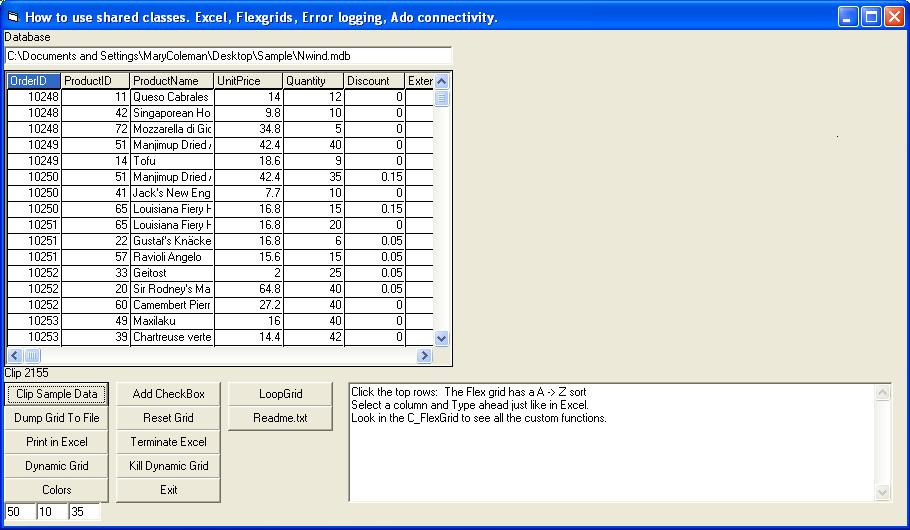



## Flexgrid ADO Excel Wrapper Classes Event Binds for custom controls\. ex\. TypeAhead and Column Sorting

### Description

Wrapper Classes for Ado and Flexgrid. Resuable code for fast error friendly code. Learn how to bind the events of a control to a class and customize standard contols. My example is a group of classes that include a flexgrid wrapper that adds type-ahead, column sorting and Dynamic adding of flexgrid to the form and many other functions; Ado wrapper for SQL and MDB connections; Excel class that allows dumping of a flexgrid straight into excel then formats it.
 
### More Info
 
Project Requires Excel, and MDAC and MSflexgrid look at the refrences.bmp to see them. Tested with MDAC 2.6,2.7,2.8 and Excel 97,2003

No side effects

             |
---                |---
**Submitted On**   |2004-07-19 17:38:12
**By**             |[Stephen Coleman](https://github.com/Planet-Source-Code/PSCIndex/blob/master/ByAuthor/stephen-coleman.md)
**Level**          |Intermediate
**User Rating**    |5.0 (35 globes from 7 users)
**Compatibility**  |VB 5\.0, VB 6\.0
**Category**       |[Custom Controls/ Forms/  Menus](https://github.com/Planet-Source-Code/PSCIndex/blob/master/ByCategory/custom-controls-forms-menus__1-4.md)
**World**          |[Visual Basic](https://github.com/Planet-Source-Code/PSCIndex/blob/master/ByWorld/visual-basic.md)
**Archive File**   |[Flexgrid\_A1771777192004\.zip](https://github.com/Planet-Source-Code/stephen-coleman-flexgrid-ado-excel-wrapper-classes-event-binds-for-custom-controls-ex-type__1-55036/archive/master.zip)

### API Declarations

Project included

